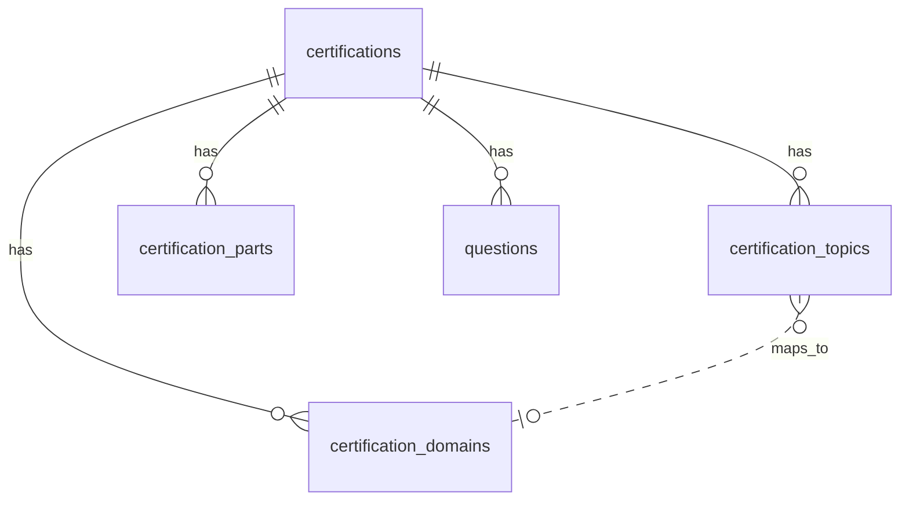

# Database (PostgreSQL)

## Kết nối

| Biến | Mô tả |
|------|--------|
| `PGHOST`, `PGPORT`, `PGDATABASE`, `PGUSER`, `PGPASSWORD` | Script migrate (Node) |
| `DATABASE_URL` | FastAPI / Alembic |

## Bảng

### `certifications`

Thông tin chứng chỉ (không còn cột `meta` JSONB).

| Cột | Kiểu | Ghi chú |
|-----|------|---------|
| `id` | varchar(32) PK | `ai-102`, `gh-300` |
| `exam_code` | varchar(32) | |
| `grid_page_size` | int | Mặc định 50 |
| `source_file_count` | int | Số file JSON nguồn (AI-102) |

### `certification_domains`

Danh mục skills-measured / domain theo chứng chỉ (editable qua API).

| Cột | Kiểu | Ghi chú |
|-----|------|---------|
| `cert_id` | FK | |
| `slug` | varchar(64) | Unique per cert |
| `title` | varchar(256) | Nhãn hiển thị |
| `sort_order` | int | |
| `exam_weight_pct` | numeric | Tùy chọn |
| `is_active` | bool | |

Seed: `data/taxonomy/{cert-id}.json` → `npm run migrate:questions`.

### `certification_topics`

ExamTopics (hoặc topic nội bộ) → domain chính.

| Cột | Kiểu | Ghi chú |
|-----|------|---------|
| `cert_id` | FK | |
| `topic_number` | varchar(16) | VD `"1"` … `"15"` |
| `label` | varchar(256)? | |
| `primary_domain_slug` | varchar(64)? | Khớp `certification_domains.slug` |

### `certification_parts`

Cấu trúc part cho dashboard & quiz (slice câu hỏi).

| Cột | Kiểu | Ghi chú |
|-----|------|---------|
| `cert_id` | FK | |
| `sort_order` | int | Thứ tự part (0-based) |
| `domain_id` | varchar(64)? | Slug domain; null cho GH-300 |
| `title` | varchar(256) | Tiêu đề part |
| `question_count` | int | Số câu trong part |

`part_starts` **không lưu DB** — API tính cumulative sum khi đọc.

### `questions`

Một row = một câu hỏi. Stats (`total`, `domainStats`, `topics`) **tính từ đây**.

| Cột | Kiểu |
|-----|------|
| `cert_id`, `external_id`, `sort_order` | |
| `topic`, `domain_id` | Phân loại (validate theo taxonomy khi sửa qua API) |
| `choices`, `correct`, `images` | jsonb |

### `quiz_sessions`

Kết quả quiz (phase sau).

## ER (rút gọn)



## Taxonomy (file → DB)

Chỉnh sửa `data/taxonomy/ai-102.json` (domains, topics, parts), rồi:

```powershell
npm run db:migrate
npm run migrate:questions
```

API:

- `GET /api/v1/certs/{cert_id}/taxonomy`
- `PUT /api/v1/certs/{cert_id}/taxonomy` (admin)
- `GET /api/v1/certs/{cert_id}/layout` — gồm `domains`, `topicMap`

## Migration

```powershell
npm run db:migrate
npm run migrate:questions
```

Revision `006`: `certification_domains`, `certification_topics`.
