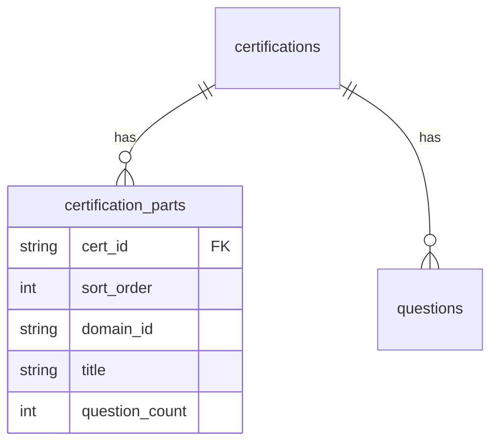

# Database (PostgreSQL)

## Kết nối

| Biến | Mô tả |
|------|--------|
| `PGHOST`, `PGPORT`, `PGDATABASE`, `PGUSER`, `PGPASSWORD` | Script migrate (Node) |
| `DATABASE_URL` | FastAPI / Alembic |

## Bảng

### `certifications`

Thông tin chứng chỉ (không còn cột `meta` JSONB).

| Cột | Kiểu | Ghi chú |
|-----|------|---------|
| `id` | varchar(32) PK | `ai-102`, `gh-300` |
| `exam_code` | varchar(32) | |
| `grid_page_size` | int | Mặc định 50 |
| `source_file_count` | int | Số file JSON nguồn (AI-102) |

### `certification_parts`

Cấu trúc part/domain cho dashboard & quiz.

| Cột | Kiểu | Ghi chú |
|-----|------|---------|
| `cert_id` | FK | |
| `sort_order` | int | Thứ tự part (0-based) |
| `domain_id` | varchar(64)? | AI-102 domains; null cho GH-300 |
| `title` | varchar(256) | Tiêu đề part |
| `question_count` | int | Số câu trong part |

`part_starts` **không lưu DB** — API tính cumulative sum khi đọc.

### `questions`

Một row = một câu hỏi. Stats (`total`, `domainStats`, `topics`) **tính từ đây**.

| Cột | Kiểu |
|-----|------|
| `cert_id`, `external_id`, `sort_order` | |
| `topic`, `domain_id` | Phân loại |
| `choices`, `correct`, `images` | jsonb |

### `quiz_sessions`

Kết quả quiz (phase sau).

## ER (rút gọn)



## Migration

```powershell
npm run db:migrate
npm run migrate:questions
```

Revision `002`: tách `certification_parts`, xóa `meta`.
